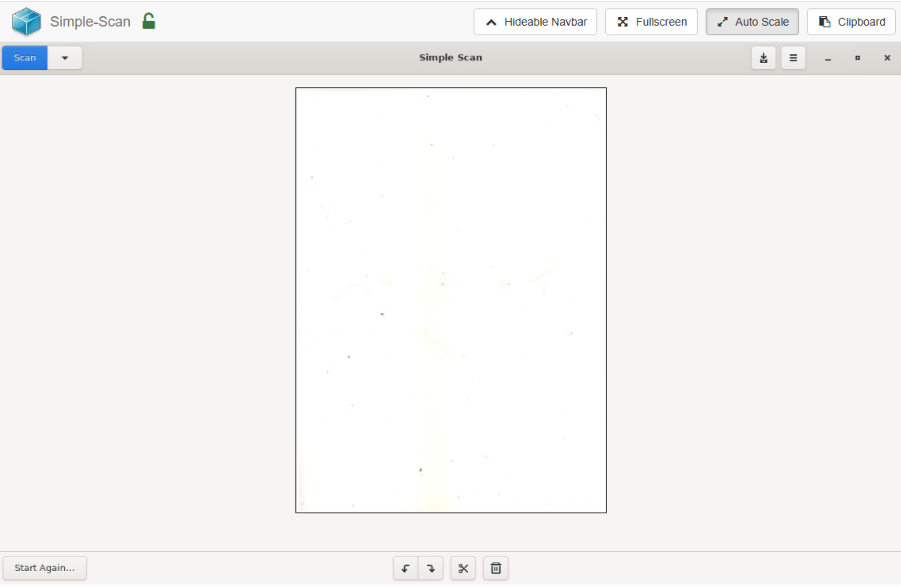

# SimpleScan Web

A simple, Dockerized scanning app with a web interface for all-in-one USB printers and USB scanners.

---

## 🚀 Quick Start

### 1. Clone the repository

```bash
git clone https://github.com/LeopardWatt/simplescan-web.git
cd simplescan-web
```

---

### 2. Build the Docker image

```bash
docker build -t simplescan-web .
```

---

### 3. Run with Docker Compose

```bash
docker-compose up -d
```

---

### 4. Browse the app

Open your browser and visit:

```
http://localhost:5800
```

---

### 🎉 Enjoy scanning with SimpleScan Web!

---

## 🖼️ Screenshot



---

## File Sharing

There is **no built-in file sharing option** in SimpleScan Web at the moment.  
You can use another solution, such as **SMB (Samba)**, to share or transfer scanned files on your own setup.

---

## Notes

- 🔧 Make sure to change volume paths or ports in `docker-compose.yaml` to suit your environment.
- ⚠️ If you run into permission issues with devices or USB scanners, consider running with appropriate privileges.

---
